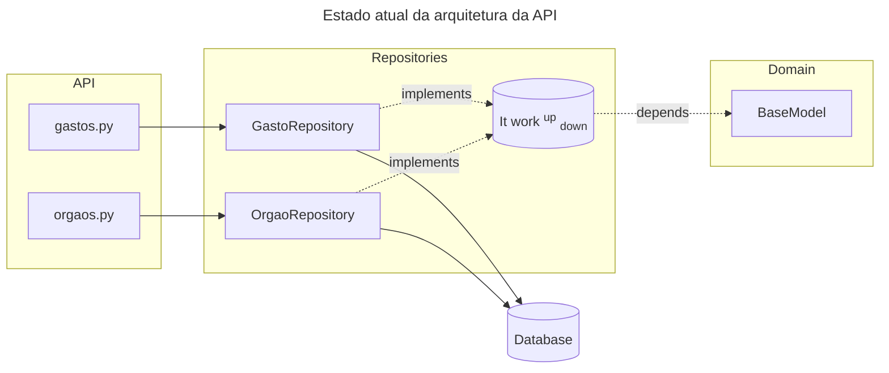

# Challenge 01 — Painel de Transparência Pública
### Tema: Impacto Social · Acessibilidade de Dados

# Como usar
## Dependências
```
python
pip
uv
```

## Como executar

### Localmente
Para executar localmente:
```sh
make run
```

### Containerizado

#### Dependências
```
docker
docker-compose
```

#### Execução
```sh
docker compose up
```

## Testes
### Execução de testes por aquivo
```sh
TEST_FILE=/file/to/run make test
```

### Para executar todos os testes
```sh
make test
```

## Decisões de Design

### Params(`pydantic.BaseModel`) para receber `URLQueryParams`
Optei por utilizar uma classe derivada do `pydantic.BaseModel` para guarar os URLQueryParams passados pelo usuário, isso além de faciltiar a distruição de parâmetros para classes dependentes da API (é só dar `params.key`), garante type checking em todos os campos recebidos do usuário

### Pattern Repository para conexão ao banco
Criei uma classe `BaseRepository` que tem as operações comuns a todos os repositórios (listagem de todos os elementos da classe, count do número de elementos na tabela, listagem por id, filtros e paginação)

Ao adicionar essa camada intermediária entre o `database` e a `api`, eu evito que regras ligadas a manipulação de banco sejam tratadas diretamente na camada da `api`

Se tivessemos rotas de `post`, `put`, `patch` e `delete` eu poderia ainda criar uma camada de use-cases para guardar regras de negócio, mas como só temos listagem, não foi necessário


### Biblioteca de paginação própria
Como a bibliteca de paginação da FastAPI (`fastapi-pagination`) não se dá bem com caching, criei um sistema simples de paginação no `BaseRepository._paginate()`, mas acabou não sendo de grande ajuda porque a biblioteca de caching também não funcionou com ele e tive que fazer a minha própria

### Bibliteca de caching própria (`@cachetools.cached()` wrapper)
Estava tendo problemas com `X-Cache` não refletindo se houve ou não colisão ao usar `fastapi-cache`, então desenvolvi um wrapper direto para a biblioteca `cachetools` que soluciona o problema de maneira elegante, `cachetools.cached` age como função de ordem mais baixa em relação ao wrapper `src.infra.cache` (como em todo wrapping) e eu extendo suas funcionalidades adicionando o header `X-Cache`, que ele não define

### Uso de UUIDv8 como chave primária de todas as tabelas
Com as acelerações de insersão que `UUIDv8` trouxe, adicionei `uuid6` como dependência, trazendo esses ids mais modernos para a aplicaçãos sem perder tanta velocidade de escrita, além disso, se eu quiser ordenar uma tabela por tempo, usar o `UUIDv8` tem complexidade de tempo menor que usar uma coluna `datetime`

### Indexação de campos usados em busca
Adicionei indexação nos campos de nome de todos os modelos já que eles seriam usados nas buscas por correlações (poderia ser no `id`, mas optei por usar os nomes para ser mais mnemonico na hora de consumir a API).
