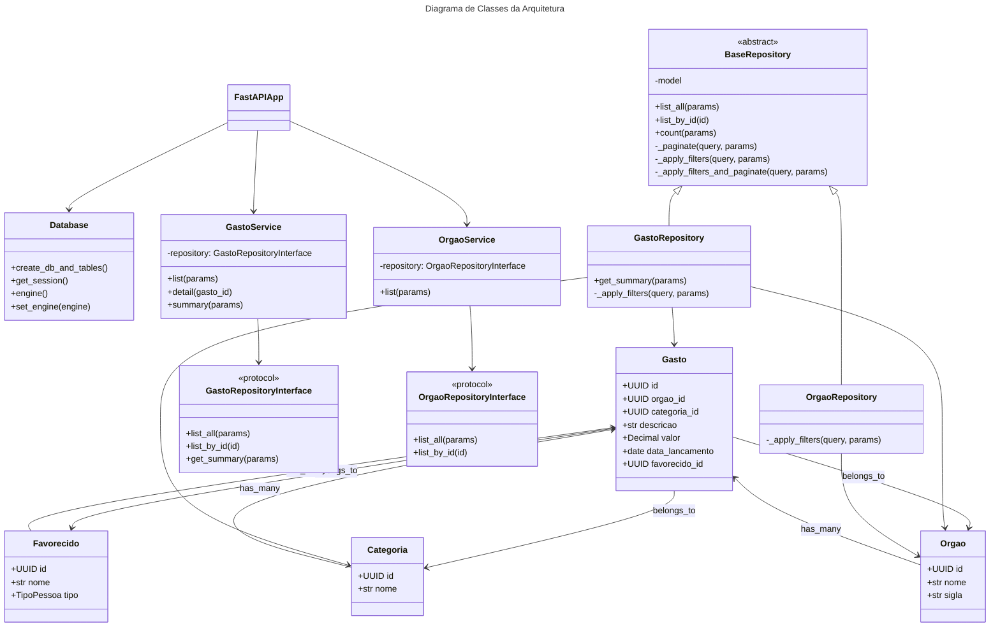
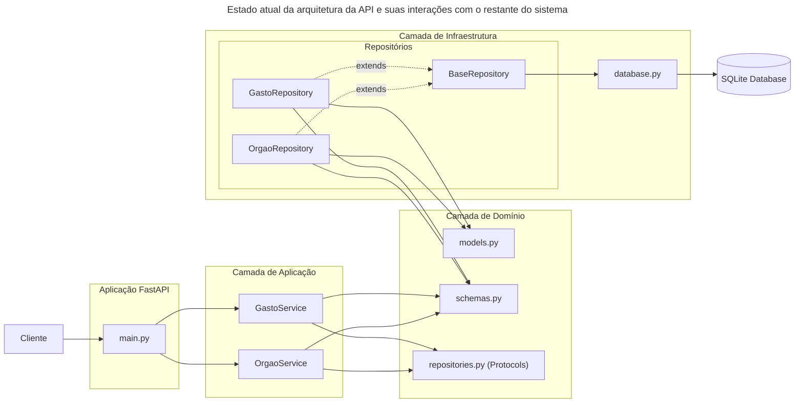

# Challenge 01 — Painel de Transparência Pública
### Tema: Impacto Social · Acessibilidade de Dados

# Como usar
## Dependências
```
python
pip
uv
```

## Como executar

### Localmente
Para executar localmente:
```sh
make run
```

### Containerizado

#### Dependências
```
docker
docker-compose
```

#### Execução
```sh
docker compose up
```

## Testes
### Execução de testes por arquivo
```sh
TEST_FILE=/file/to/run make test
```

### Para executar todos os testes
```sh
make test
```

## Decisões de Design

### Params (`pydantic.BaseModel`) para receber `URLQueryParams`
Optei por utilizar uma classe derivada de `pydantic.BaseModel` para guardar os `URLQueryParams` passados pelo usuário. Isso, além de facilitar a distribuição de parâmetros para classes dependentes da API, já que basta acessar `params.key`, também garante type checking em todos os campos recebidos via API.

### Pattern Repository para conexão ao banco
Criei uma classe `BaseRepository` com as operações comuns a todos os repositórios, como listagem de todos os elementos da classe, count do número de elementos na tabela, listagem por `id`, filtros e paginação.

Ao adicionar essa camada intermediária entre o `database` e a `api`, evito que regras ligadas à manipulação do banco sejam tratadas diretamente na camada da API.

Se tivéssemos rotas de `post`, `put`, `patch` e `delete`, eu poderia ainda criar uma camada de use cases para concentrar regras de negócio, mas como aqui só temos listagens, isso não foi necessário.

### Biblioteca de paginação própria
Como a biblioteca de paginação da FastAPI (`fastapi-pagination`) não se dá bem com a de caching, criei um sistema simples de paginação no `BaseRepository._paginate()`. Ainda assim, a biblioteca de cache também não funcionou bem nesse cenário, então precisei implementar a minha própria solução.

### Biblioteca de caching própria (`@cachetools.cached()` wrapper)
Estava tendo problemas com o header `X-Cache`, que não refletia corretamente se houve ou não reaproveitamento de resultado ao usar `fastapi-cache`. Por isso, desenvolvi um wrapper direto sobre a biblioteca `cachetools`. O `cachetools.cached` funciona como a função de ordem mais baixa em relação ao wrapper `src.infra.cache.cache`, e eu estendo seu comportamento adicionando o header `X-Cache`, que ele não define nativamente.

### Uso de UUIDv8 como chave primária de todas as tabelas
Com os ganhos de inserção trazidos pelo `UUIDv8`, adicionei `uuid6` como dependência e usando sua implementação de `UUIDv8`, trazendo IDs mais modernos para a aplicação sem perder tanta velocidade de escrita. Além disso, se eu quiser ordenar uma tabela por tempo, usar `UUIDv8` tende a ser mais eficiente do que depender de uma coluna `datetime`.

### Indexação de campos usados em busca
Adicionei indexação aos campos de nome de todos os modelos, já que eles seriam usados nas buscas por correlação. Poderia ter feito isso via `id`, mas optei pelos nomes para tornar o consumo da API mais mnemônico.

### Camada de Application
Criei uma camada de `application`, onde devem ficar os `services` e eventuais `use cases`. A ideia é seguir a separação comum em DDD: `/domain` lida com interfaces e declarações de dados, `/infra` lida com as interações com o banco e `/application` concentra as regras de negócio. Os services ficaram relativamente enxutos porque não existem muitas regras associadas às consultas, mas a camada já está preparada.

### Interfaces para os Repositories
Foram desenvolvidas interfaces usando `typing.Protocol` para os `repositories`, respeitando uma separação de responsabilidades comum em linguagens tipadas. Assim, as interfaces consumidas pela aplicação ficam definidas dentro de `/domain`.


### Diagramas

#### Diagrama de Classes


#### Flowchart da API

